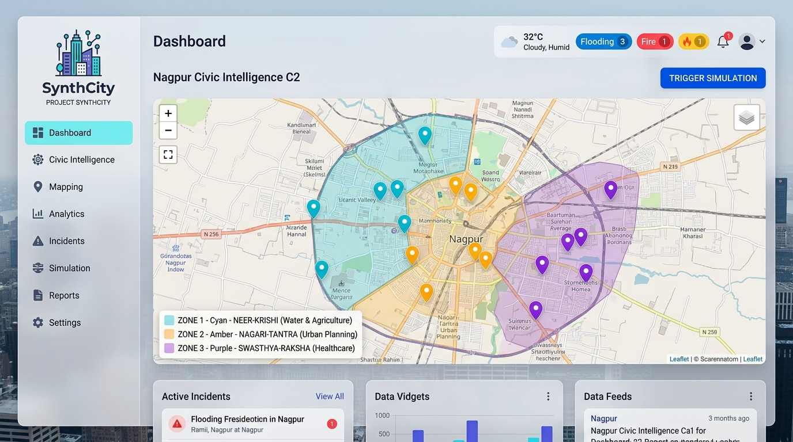
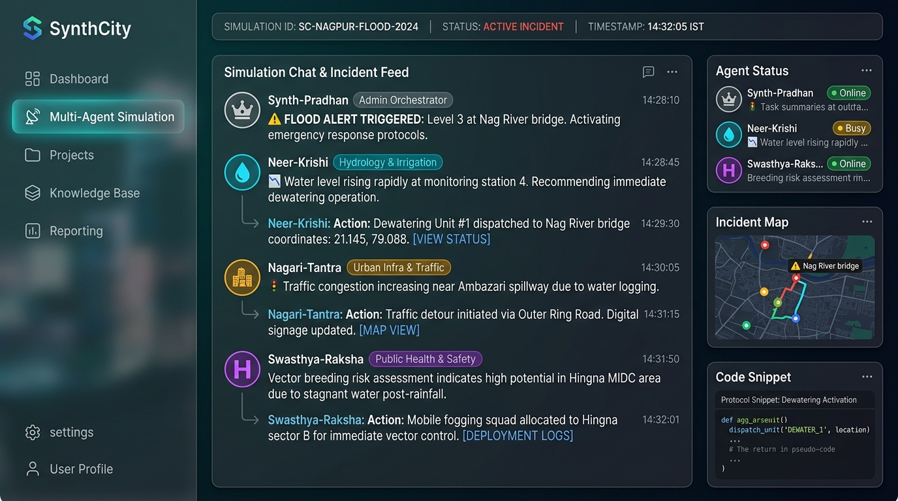
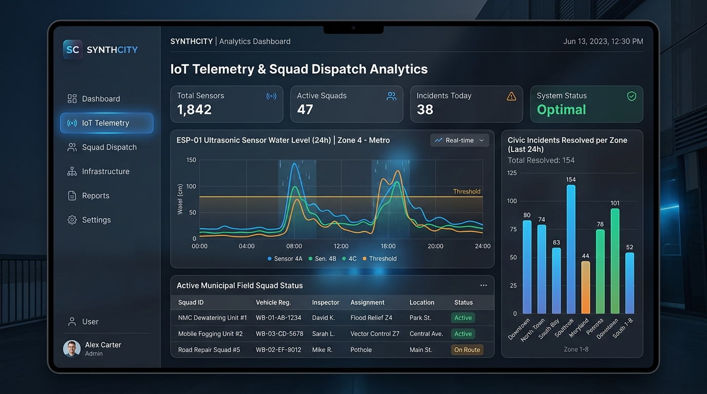

# Project SynthCity: Nagpur Multi-Agent Civic Intelligence Platform 🏙️💧⚡

[](https://yuvrajlokhande19.github.io/synthcity/)
[](https://yuvrajlokhande19.github.io/synthcity/)
[](https://www.python.org/)
[](https://developer.mozilla.org/)
[](https://leafletjs.com/)
[](https://tailwindcss.com/)

> **Project SynthCity** is an autonomous, multi-agent civic intelligence and crisis response platform designed specifically for the **Nagpur Metropolitan Region, Maharashtra, India**. The system integrates hardware IoT telemetry (ESP-01 flood sensors), open weather data (Open-Meteo REST API), citizen Telegram reporting, dynamic field squad routing, and a 6-tier AI multi-agent orchestrator.

---

## 🌐 Live System Demo

🔗 **Interactive Live Web App**: [https://yuvrajlokhande19.github.io/synthcity/](https://yuvrajlokhande19.github.io/synthcity/)

No installation required to view the live interface! Simply open the link above to explore the interactive Nagpur geospatial map, trigger real-time flood simulations, view multi-agent neural chats, and inspect live field squad routing.

---

## 📸 System Screenshots & UI Walkthrough

### 1. Main Civic Intelligence Command & Control Dashboard
*Interactive Leaflet.js map with Nagpur zone polygons (Neer-Krishi, Nagari-Tantra, Swasthya-Raksha), real-time weather cards, and pulse markers.*



---

### 2. Multi-Agent Neural Chat & Disaster Incident Simulation
*Real-time AI-to-AI inter-agent reasoning stream orchestrating emergency response dispatches between Synth-Pradhan, Neer-Krishi, Nagari-Tantra, and Swasthya-Raksha.*



---

### 3. IoT Telemetry & Field Squad Dispatch Analytics
*24-hour ESP-01 ultrasonic sensor water-level telemetry graph, incident resolution analytics per zone, and active municipal field squad tracker.*



---

## 🤖 6-AI Agent Multi-Tier Architecture

SynthCity operates using **6 specialized AI agents** structured in a 3-tier operational hierarchy:

```
                          ┌─────────────────────────────────────────┐
                          │   👑 Synth-Pradhan (Admin AI Liaison)   │
                          │     District Orchestrator & Command      │
                          └────────────────────┬────────────────────┘
                                               │
             ┌─────────────────────────────────┼─────────────────────────────────┐
             ▼                                 ▼                                 ▼
   ┌───────────────────┐             ┌───────────────────┐             ┌───────────────────┐
   │  💧 Neer-Krishi   │             │ 🏙️ Nagari-Tantra  │             │ 🏥 Swasthya-Raksha│
   │  Zone 1 Hydro-Agri│             │ Zone 2 Urban Infra│             │ Zone 3 Health-Sani│
   └─────────┬─────────┘             └─────────┬─────────┘             └─────────┬─────────┘
             │                                 │                                 │
             └─────────────────────────────────┼─────────────────────────────────┘
                                               │
                                ┌──────────────┴──────────────┐
                                ▼                             ▼
                      ┌───────────────────┐         ┌───────────────────┐
                      │  📡 Data-Mitra    │         │ 🔄 Marg-Darshak   │
                      │  Backup AI 1      │         │ Backup AI 2       │
                      │ Ingestion & Weather│        │ Route & Logistics │
                      └───────────────────┘         └───────────────────┘
```

| Agent Symbol & Name | Operational Domain | Role & Hierarchy Tier | Key Directives & Capabilities |
| :--- | :--- | :--- | :--- |
| **👑 Synth-Pradhan** | District-wide (Nagpur) | Tier 1 (Executive Admin) | Approves municipal dispatches, issues executive orders, manages cross-zone escalation. |
| **💧 Neer-Krishi** | Zone 1 (Kamptee / Godhani) | Tier 2 (Hydro-Agri Core) | Monitors Nag River level surges, ESP-01 IoT telemetry, coordinates dewatering pumps. |
| **🏙️ Nagari-Tantra** | Zone 2 (Sitabuldi / Dharampeth) | Tier 2 (Urban Infrastructure) | Resolves traffic gridlocks, stormwater culvert clearance, municipal garbage queues. |
| **🏥 Swasthya-Raksha** | Zone 3 (Hingna MIDC / Ambazari) | Tier 2 (Health & Sanitation) | Tracks industrial runoff, predicts dengue vector breeding, dispatches mobile fogging. |
| **📡 Data-Mitra** | System-Wide Knowledge | Tier 3 (Data Ingestion) | Ingests Open-Meteo weather telemetry, Google News RSS, and uploaded documents. |
| **🔄 Marg-Darshak** | Metropolitan Transit Network | Tier 3 (Route & Logistics) | Calculates optimal detour routes (Outer Ring Road / Wardha Road) and pump squad ETAs. |

---

## ⚡ Key Technical Features & Innovations

1. **Zero-Cost High Resilience AI Stack**:
   - **Gemini Key Rotator**: Automatically rotates API keys upon encountering HTTP `429 Too Many Requests` or quota thresholds.
   - **Dynamic Model Failover Chain**: Seamlessly cascades across `gemini-3.5-flash-lite` $\rightarrow$ `gemini-3.5-flash` $\rightarrow$ `gemini-3.6-flash`.
   - **Open-Source Basemaps**: CARTO Dark Matter & Voyager layers zero-token Leaflet configuration.

2. **IoT Hardware Telemetry Integration**:
   - Direct HTTP POST ingestion from **ESP-01 (ESP8266) + HC-SR04 ultrasonic sensors** deployed at critical water monitoring nodes (e.g., Nag River Kamptee Bridge).

3. **Live Weather Telemetry Ingestion**:
   - Auto-synchronizes with **Open-Meteo REST API** targeted at Nagpur coordinates (`21.1458° N, 79.0882° E`), fetching temperature, rain probability, precipitation volume, and wind speed.

4. **Multi-Channel Citizen Engagement & Dispatches**:
   - Integrated **Telegram Bot API** (`@SynthCityNagpurBot`) receiving citizen complaint reports and auto-plotting geocoded incidents on the interactive map.
   - Dispatches emergency notices via **WhatsApp Business / Twilio API** to key municipal field leads.

5. **Glassmorphism Interactive Dashboard**:
   - Clean, lightweight frontend built with HTML5, Tailwind CSS, Leaflet.js, Lucide Icons, and Chart.js.
   - Real-time simulation trigger for instant demonstration of disaster management protocols.

---

## 🔌 Hardware Setup: ESP-01 Ultrasonic Flood Sensor

SynthCity supports live flood level monitoring using low-cost ESP8266 hardware:

```
    ┌───────────────────────┐                  ┌───────────────────────┐
    │     ESP8266 ESP-01    │                  │  HC-SR04 ULTRASONIC   │
    │                       │                  │                       │
    │  GPIO0  ──────────────┼──────────────────┼──> TRIG               │
    │  GPIO2  ──────────────┼──────────────────┼──> ECHO               │
    │  VCC / CH_PD  ────────┼──────────────────┼──> 3.3V Power         │
    │  GND  ────────────────┼──────────────────┼──> Common Ground      │
    └───────────────────────┘                  └───────────────────────┘
```

### Flash Hardware Firmware:
1. Open `esp01_flood_sensor.ino` in the Arduino IDE.
2. Select **Generic ESP8266 Module** as the target board.
3. Set your local Wi-Fi SSID and Password.
4. Upload to the ESP-01 module to begin streaming live distance telemetry to the backend!

---

## 📁 Repository Structure

```
SynthCity/
├── index.html              # Main Command & Control Dashboard (GitHub Pages Ready)
├── styles.css              # Glassmorphism styling, dark mode, animations
├── app.js                  # Frontend Leaflet map engine, telemetry & simulation UI logic
├── config.js               # Zone boundaries, map tile endpoints & geocoding dictionary
├── synthcity_engine.py     # Python Multi-Agent AI Engine with Key Rotator & Failover
├── bot_engine.py           # Telegram Bot integration engine
├── backend.py              # FastAPI / Python backend server
├── esp01_flood_sensor.ino  # C++ Arduino firmware for ESP-01 IoT flood sensor
├── firebase_schema.json    # Firebase Realtime Database schema
├── database.rules.json     # Firebase security rules
├── requirements.txt        # Python dependency requirements
├── assets/
│   └── screenshots/        # High-res UI screenshot assets
└── *.csv / *.xls           # Nagpur district demographic, health & ambulance datasets
```

---

## 🛠️ Quick Start Guide (Local Setup)

### 1. Clone the Repository
```bash
git clone https://github.com/yuvrajlokhande19/synthcity.git
cd synthcity
```

### 2. Run the Web Dashboard (Frontend)
Simply open `index.html` in any web browser, or launch using Python's static server:

```bash
python -m http.server 8000
```
Then navigate to `http://localhost:8000` in your web browser.

### 3. Run the AI Multi-Agent Engine (Backend Optional)
To enable real-time Gemini AI response generation and key rotation:

```bash
pip install -r requirements.txt
cp api_keys.example.txt api_keys.txt  # Add your Gemini API keys here
python synthcity_engine.py
```

To execute an immediate mock disaster simulation via terminal:
```bash
python synthcity_engine.py --trigger-disaster
```

---

## 📊 Datasets Included

This repository includes real-world civic & demographic datasets for Nagpur:
- `DCHB_Town_Amenities-Maharashtra-NAGPUR-505.csv`: District Census Handbook town amenities matrix.
- `DCHB_Village_Amenities-Maharashtra-Nagpur-505.csv`: Rural village amenities dataset.
- `Ambulance_102_Information_Nagpur__0.csv`: 102 Ambulance service registry & dispatch locations.
- `NFHS_5_Factsheets_Data.xls`: National Family Health Survey (NFHS-5) factsheet statistics for Nagpur district.

---

## ☁️ Deployment

The frontend dashboard is static and optimized for zero-cost hosting on **GitHub Pages**:

1. Fork or clone this repository.
2. Go to **Settings** $\rightarrow$ **Pages** in your GitHub repository.
3. Under **Source**, select `Deploy from a branch` and set Branch to `main` (`/ (root)`).
4. Click **Save**. Your site will be live at `https://<your-username>.github.io/synthcity/` within minutes!

---

## 📜 License & Credits

Designed & Developed with ❤️ for **Nagpur Metropolitan Region** and Civic Tech Innovation.
Licensed under the [MIT License](LICENSE).
