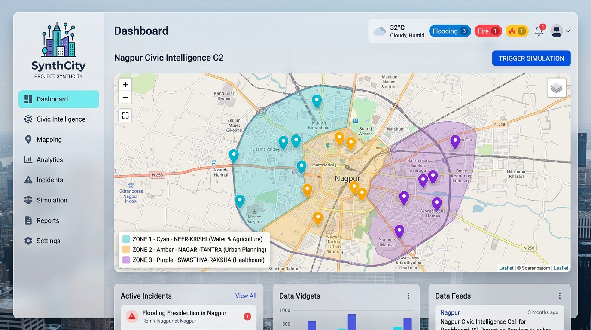
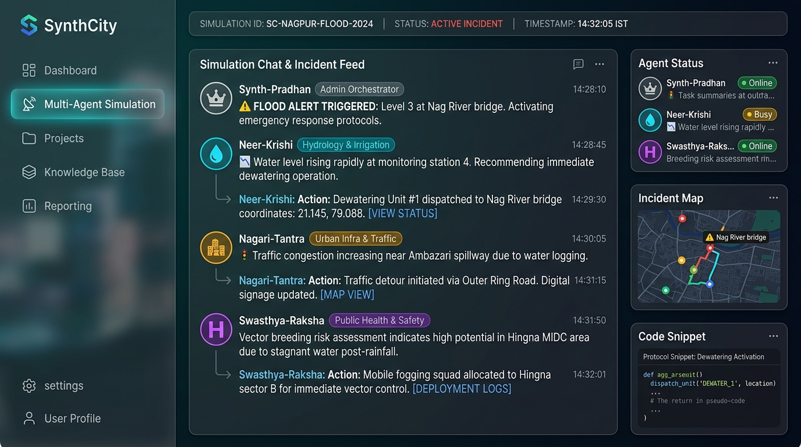
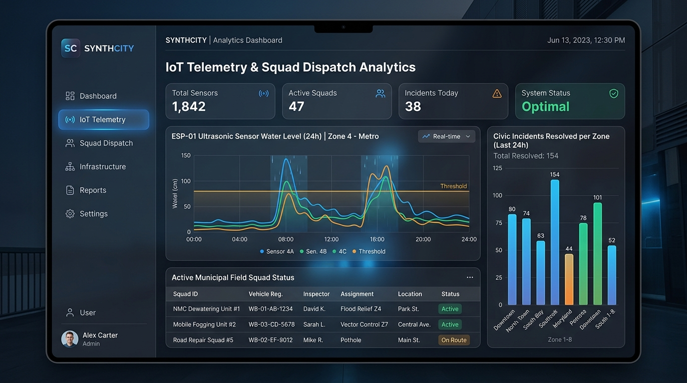
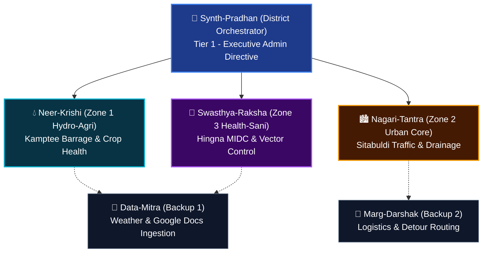

# Project SynthCity: Autonomous Multi-Agent Civic Intelligence Platform 🏙️💧⚡

<div align="center">


[](https://yuvrajlokhande19.github.io/synthcity/)
[](https://nmcnagpur.gov.in/)
[](https://yuvrajlokhande19.github.io/synthcity/)
[](https://yuvrajlokhande19.github.io/synthcity/)
[](https://www.python.org/)
[](LICENSE)

<p align="center">
  <b>Autonomous Multi-Agent Civic Orchestration, IoT Flood Telemetry & Real-Time Emergency Management for Nagpur Municipal Corporation (NMC)</b>
</p>

[🌐 **Launch Live Demo App**](https://yuvrajlokhande19.github.io/synthcity/) • [📸 **UI Screenshots**](#-system-screenshots--ui-walkthrough) • [🤖 **Multi-Agent Architecture**](#-6-ai-agent-multi-tier-architecture) • [🔌 **ESP32 Hardware Setup**](#-iot-hardware-telemetry--esp32-flood-station) • [🛠️ **Quick Start**](#️-quick-start-guide)

</div>

---

## 🌟 Overview

**Project SynthCity** is an autonomous multi-agent civic intelligence and crisis response platform purpose-built for the **Nagpur Municipal Corporation (NMC) & Nagpur Smart City (NSSCDCL)** under the leadership of Municipal Commissioner & CEO **Dr. Vipin Itankar, IAS**.

The platform bridges real-time **ESP32 IoT ultrasonic hydrological telemetry**, Open-Meteo weather forecasts, citizen reporting via Telegram C2 bot, dynamic municipal squad routing, and a **6-tier AI multi-agent swarm** powered by intelligent key rotation and multi-model cascade (Gemini 3.1 Flash Lite $\rightarrow$ Gemma 4 $\rightarrow$ Gemini 3.6 Flash).

```
╔══════════════════════════════════════════════════════════════════════════════════════════════╗
║                                  SYNTHCITY CORE CAPABILITIES                                 ║
╠══════════════════════════════════════════════════════════════════════════════════════════════╣
║  • Autonomous Multi-Agent AI Swarm       • ESP32 + HC-SR04 Ultrasonic Telemetry Ingestion    ║
║  • Contiguous Geospatial Geofences (GIS) • Telegram C2 Bot & WhatsApp-Style Web Console     ║
║  • Live Google Docs Ingestion Matrix     • Real-time Flash Flood & Traffic Detour Simulator  ║
╚══════════════════════════════════════════════════════════════════════════════════════════════╝
```

---

## 🌐 Live System Demo

🚀 **Interactive Web Application**: [https://yuvrajlokhande19.github.io/synthcity/](https://yuvrajlokhande19.github.io/synthcity/)

> [!TIP]
> **Zero Installation Required**: Open the link above in any modern browser to explore the interactive Esri geospatial map, trigger real-time Nag River flood simulations, test the WhatsApp-style Telegram dispatch console, and view live 24h ESP32 telemetry charts.

---

## 📸 System Screenshots & UI Walkthrough

### 1. Main Civic Intelligence Command & Control Dashboard
*Interactive GIS map with contiguous Nagpur zone polygons (Neer-Krishi, Nagari-Tantra, Swasthya-Raksha), live weather telemetry, active incident tickets, and quick scenario triggers.*



---

### 2. Multi-Agent Neural Chat & Disaster Incident Simulation
*Real-time AI-to-AI reasoning feed and execution stream orchestrating emergency response dispatches between Synth-Pradhan, Neer-Krishi, Nagari-Tantra, and Swasthya-Raksha.*



---

### 3. IoT Telemetry & Field Squad Dispatch Analytics
*24-hour ESP32 ultrasonic sensor water-level telemetry graph with dual flood peaks and 80cm critical threshold, civic resolution bar charts, and active municipal squad fleet tracker.*



---

## 🤖 6-AI Agent Multi-Tier Architecture

SynthCity operates using **6 specialized AI personas** structured in an autonomous command hierarchy:


```mermaid
flowchart TD
    Admin["👑 Synth-Pradhan (District Orchestrator)<br/>Tier 1 - Executive Admin Directive"]
    
    Z1["💧 Neer-Krishi (Zone 1 Hydro-Agri)<br/>Kamptee Barrage & Crop Health"]
    Z2["🏙️ Nagari-Tantra (Zone 2 Urban Core)<br/>Sitabuldi Traffic & Drainage"]
    Z3["🏥 Swasthya-Raksha (Zone 3 Health-Sani)<br/>Hingna MIDC & Vector Control"]
    
    D1["📡 Data-Mitra (Backup 1)<br/>Weather & Google Docs Ingestion"]
    D2["🔄 Marg-Darshak (Backup 2)<br/>Logistics & Detour Routing"]

    Admin --> Z1
    Admin --> Z2
    Admin --> Z3
    Z1 -.-> D1
    Z2 -.-> D2
    Z3 -.-> D1
    
    classDef admin fill:#1e3a8a,stroke:#3b82f6,stroke-width:2px,color:#fff;
    classDef z1 fill:#083344,stroke:#06b6d4,stroke-width:2px,color:#fff;
    classDef z2 fill:#451a03,stroke:#f59e0b,stroke-width:2px,color:#fff;
    classDef z3 fill:#3b0764,stroke:#a855f7,stroke-width:2px,color:#fff;
    classDef backup fill:#0f172a,stroke:#64748b,stroke-width:1px,color:#fff;

    class Admin admin;
    class Z1 z1;
    class Z2 z2;
    class Z3 z3;
    class D1,D2 backup;
```

### Agent Domain Matrix

| Agent Symbol & Name | Operational Domain | Role & Hierarchy Tier | Key Directives & Capabilities |
| :--- | :--- | :--- | :--- |
| **👑 Synth-Pradhan** | District-wide (Nagpur) | Tier 1 (Executive Admin) | Approves municipal dispatches, issues executive orders, manages cross-zone escalation. |
| **💧 Neer-Krishi** | Zone 1 (Kamptee / Kanhan) | Tier 2 (Hydro-Agri Core) | Monitors Nag River level surges, ESP32 IoT telemetry, coordinates dewatering pumps. |
| **🏙️ Nagari-Tantra** | Zone 2 (Sitabuldi / Dharampeth) | Tier 2 (Urban Infrastructure) | Resolves traffic gridlocks, stormwater culvert clearance, municipal garbage queues. |
| **🏥 Swasthya-Raksha** | Zone 3 (Hingna MIDC / MIHAN) | Tier 2 (Health & Sanitation) | Tracks industrial runoff, predicts vector breeding, dispatches mobile fogging. |
| **📡 Data-Mitra** | System-Wide Knowledge | Tier 3 (Data Ingestion) | Ingests Open-Meteo weather telemetry, Google Docs live news, and uploaded documents. |
| **🔄 Marg-Darshak** | Metropolitan Transit Network | Tier 3 (Route & Logistics) | Calculates optimal detour routes (Outer Ring Road / Wardha Road) and squad ETAs. |

---

## 🔌 IoT Hardware Telemetry & ESP32 Flood Station

<div align="center">


</div>

SynthCity integrates live hydrological telemetry using the **ESP32 Microcontroller** and an **HC-SR04 Ultrasonic Distance Sensor** installed on bridge embankments (e.g. Nag River Kamptee Bridge intake):

### Hardware Wiring Pinouts

| Component Pin | ESP32 GPIO | Description | Voltage Rating |
| :--- | :--- | :--- | :--- |
| **TRIG** | `GPIO 5 (D5)` | Ultrasonic 10µs Sonar Trigger Pulse | 3.3V / 5V Logic |
| **ECHO** | `GPIO 18 (D18)` | Return Pulse Echo Duration Read | 3.3V Safe (via Divider) |
| **VCC** | `VIN / 5V` | Sensor Operating Power | 5V DC |
| **GND** | `GND` | Common Ground Reference | 0V |

```
    ┌───────────────────────┐                  ┌───────────────────────┐
    │     ESP32 Dev Board   │                  │  HC-SR04 ULTRASONIC   │
    │                       │                  │                       │
    │  GPIO 5 (D5) ─────────┼──────────────────┼──> TRIG               │
    │  GPIO 18 (D18) ───────┼──────────────────┼──> ECHO               │
    │  VIN (5V) / 3.3V  ────┼──────────────────┼──> VCC                │
    │  GND  ────────────────┼──────────────────┼──> GND (Common)       │
    └───────────────────────┘                  └───────────────────────┘
```

### Firmware Flash Instructions:
1. Open [`esp32_flood_sensor.ino`](esp32_flood_sensor.ino) in the Arduino IDE.
2. Select **ESP32 Dev Module** from the Tools $\rightarrow$ Board menu.
3. Configure your local Wi-Fi credentials (`WIFI_SSID`, `WIFI_PASSWORD`).
4. Upload to the ESP32 to begin streaming real-time distance telemetry to the C2 backend!

---

## ⚡ Key Technical Features & Innovations

1. **Zero-Cost High-Resilience Multi-Model Cascade**:
   - Rotates API keys upon encountering HTTP `429 Too Many Requests`.
   - Cascades from `gemini-3.1-flash-lite` $\rightarrow$ `gemma-4-26b` $\rightarrow$ `gemini-3.6-flash`.
   - Offline fallback simulation for stand-alone execution on GitHub Pages.

2. **Contiguous Geospatial Geofence Matrix**:
   - Features Esri World Street Map as primary default basemap with Carto Voyager, Satellite, and Dark mode rotation.
   - 3 organic contiguous zone polygons (Zone 1 Kamptee, Zone 2 Urban Core, Zone 3 Hingna/MIHAN) with zero empty gaps.

3. **WhatsApp Web-Style Telegram C2 Console**:
   - 2-panel dispatch interface with contact list (`Worker 1 U`, `Worker 2 Ritesh Alone`, `Dhynendra Gaurkar Citizen`).
   - Double blue ticks (`✓✓`), quick directive chips, and automatic rate-limiting anti-spam cooldowns.

4. **Live Google Docs Ingestion**:
   - Continuous 40-minute synchronization with live Google Docs for District News.
   - Overview live feed cards and dedicated 3-column knowledge terminal in Tab 7.

---

## 📁 Repository Structure & File Dictionary

Every file in Project SynthCity is organized with a simple, standard name and a clear single-purpose role:

```
SynthCity/
├── 🌐 Web Application & Dashboard
│   ├── index.html              # Main Glassmorphic C2 Command & Control Web Dashboard
│   ├── styles.css              # Cyber-glass styling, dark mode themes, WhatsApp UI, and tooltip animations
│   ├── app.js                  # Frontend Leaflet map engine, Chart.js telemetry, speech recognition & simulation UI
│   └── config.js               # Contiguous zone boundaries, default map tiles (Esri World Street), and API settings
│
├── 🧠 Multi-Agent AI & C2 Backend
│   ├── synthcity_engine.py     # Python 6-Agent AI engine with automatic Gemini key rotation & model failover
│   ├── backend.py              # Local HTTP/REST C2 backend server with civic dataset queries & Gemini agent routing
│   ├── bot_engine.py           # Telegram bot daemon with rate-limiting, citizen complaint intake & admin dispatches
│   ├── master_prompt.txt       # Master system prompts and knowledge guidelines for all 6 AI agent personas
│   ├── system_prompts.txt      # Quick-reference condensed prompt guidelines for local testing
│   └── project_concept.txt     # Original project ideation notes, agent debate mechanics, and civic vision
│
├── 📡 Hardware & IoT Firmware
│   └── esp32_flood_sensor.ino  # C++ Arduino firmware for ESP32 NodeMCU + HC-SR04 ultrasonic water level monitoring
│
├── 📊 Civic Datasets (Nagpur District)
│   ├── ambulance_data.csv      # Nagpur Emergency 102 Ambulance fleet directory and contact registry
│   ├── rainfall_data.csv       # Vidarbha & Nagpur monsoon historical rainfall and precipitation records
│   ├── town_amenities.csv      # Nagpur District Census Handbook - Urban civic infrastructure & amenities
│   ├── village_amenities.csv   # Nagpur District Census Handbook - Rural village infrastructure & public amenities
│   └── health_data.xls         # NFHS-5 factsheet on Nagpur district health, nutrition, and sanitation indicators
│
├── ☁️ Firebase & Configuration
│   ├── firebase_schema.json    # Firebase Realtime Database schema for multi-agent state sync
│   ├── database.rules.json     # Firebase Realtime Database security & read/write access rules
│   ├── api_keys.example.txt    # Template file for Gemini API keys and Telegram bot token
│   └── requirements.txt        # Python package dependencies (requests, google-generativeai)
│
├── 🚀 Scripts & Documentation
│   ├── START_SYSTEM.bat        # 1-Click Windows launcher for backend server, Telegram bot, and web dashboard
│   ├── README.md               # Main project documentation, live demo links, and architecture guides
│   ├── PROJECT_DOCUMENTATION.md# Deep architectural technical specification and system design
│   ├── setup_manual.md         # Comprehensive step-by-step setup and troubleshooting guide (Markdown)
│   └── setup_manual.html       # Visual standalone HTML version of the setup guide
│
└── 🖼️ Assets
    ├── assets/images/          # Generated AI hero banners & ESP32 hardware photos
    └── assets/screenshots/     # High-resolution dashboard UI reference screenshots
```

---

## 🛠️ Quick Start Guide

### 1. Clone the Repository
```bash
git clone https://github.com/yuvrajlokhande19/synthcity.git
cd synthcity
```

### 2. Launch Local Dashboard
Simply open `index.html` in any web browser, or start a local HTTP server:
```bash
python -m http.server 8000
```
Navigate to `http://localhost:8000` in your web browser.

### 3. Start Python Multi-Agent Backend (Optional)
```bash
pip install -r requirements.txt
python backend.py
```

---

## ☁️ Deployment on GitHub Pages

1. Fork or clone this repository to your GitHub account.
2. Navigate to **Settings** $\rightarrow$ **Pages**.
3. Under **Build and deployment** $\rightarrow$ **Source**, select `Deploy from a branch` and set Branch to `main` (`/ (root)`).
4. Click **Save**. Your site will be live at `https://<your-username>.github.io/synthcity/` within 60 seconds!

---

## 📜 License & Credits

Designed & Developed with ❤️ for **Nagpur Metropolitan Region** and Civic Tech Innovation.  
Licensed under the [MIT License](LICENSE).
 
- **Status:** Complete

